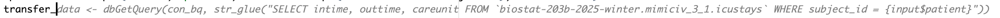
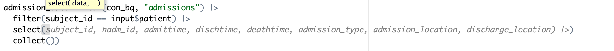
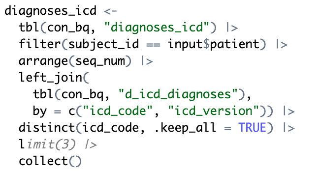
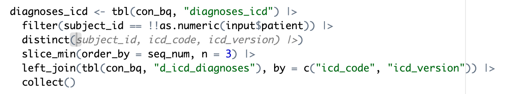

Display machine information:
```{r}
sessionInfo()
```
Display my machine memory.
```{r}
memuse::Sys.meminfo()
```

Load database libraries and the tidyverse frontend:
```{r}
library(bigrquery)
library(dbplyr)
library(DBI)
library(gt)
library(gtsummary)
library(tidyverse)
library(forcats)
```

## Q1. Compile the ICU cohort in HW3 from the Google BigQuery database 

Below is an outline of steps. In this homework, we exclusively work with the BigQuery database and should not use any MIMIC data files stored on our local computer. Transform data as much as possible in BigQuery database and `collect()` the tibble **only at the end of Q1.7**.

### Q1.1 Connect to BigQuery

Authenticate with BigQuery using the service account token. Please place the service account token (shared via BruinLearn) in the working directory (same folder as your qmd file). Do **not** ever add this token to your Git repository. If you do so, you will lose 50 points.
```{r}
# path to the service account token 
satoken <- "biostat-203b-2026-winter-92fefbfab477.json"
# BigQuery authentication using service account
bq_auth(path = "biostat-203b-2026-winter-92fefbfab477.json")
```
Connect to BigQuery database `mimiciv_3_1` in GCP (Google Cloud Platform), using the project billing account `biostat-203b-2025-winter`.
```{r}
# connect to the BigQuery database `biostat-203b-2025-mimiciv_3_1`
con_bq <- dbConnect(
    bigrquery::bigquery(),
    project = "biostat-203b-2025-winter",
    dataset = "mimiciv_3_1",
    billing = "biostat-203b-2025-winter"
)
con_bq
```
List all tables in the `mimiciv_3_1` database.
```{r}
dbListTables(con_bq)
```

### Q1.2 `icustays` data

Connect to the `icustays` table.
```{r}
# full ICU stays table
icustays_tble <- tbl(con_bq, "icustays") |>
  arrange(subject_id, hadm_id, stay_id) |>
  # show_query() |>
  print(width = Inf)
```

### Q1.3 `admissions` data

Connect to the `admissions` table.
```{r}
# # TODO
admissions_tble <- tbl(con_bq, "admissions") |>
  arrange(subject_id, hadm_id) |>
  print(width = Inf)
```

### Q1.4 `patients` data

Connect to the `patients` table.
```{r}
# # TODO
patients_tble <- tbl(con_bq, "patients") |>
  arrange(subject_id) |>
  print(width = Inf)
```

### Q1.5 `labevents` data

Connect to the `labevents` table and retrieve a subset that only contain subjects who appear in `icustays_tble` and the lab items listed in HW3. Only keep the last lab measurements (by `storetime`) before the ICU stay and pivot lab items to become variables/columns. Write all steps in _one_ chain of pipes.
```{r}
# # TODO
labevents_tble <- tbl(con_bq, "labevents") |>
  right_join(
    patients_tble,
    by = "subject_id"
  ) |>
  filter(
    itemid %in% c(50862, 50912, 50971, 
                  50983, 50902, 50882, 
                  51221, 51301, 50931)
  )|>
  left_join(
    select(icustays_tble, subject_id, stay_id, intime),
    by = "subject_id"
  ) |>
  filter(!is.na(intime), storetime < intime) |>
  group_by(subject_id, stay_id, itemid) |>
  slice_max(storetime, n = 1, with_ties = FALSE) |>
  ungroup() |>
  mutate(lab = case_when(
    itemid == 50862 ~ "albumin",
    itemid == 50912 ~ "creatinine",
    itemid == 50971 ~ "potassium",
    itemid == 50983 ~ "sodium",
    itemid == 50902 ~ "chloride",
    itemid == 50882 ~ "bicarbonate",
    itemid == 51221 ~ "hematocrit",
    itemid == 51301 ~ "wbc",
    itemid == 50931 ~ "glucose"
  )) |>
  select(subject_id, stay_id, lab, valuenum) |>
  pivot_wider(names_from = lab, values_from = valuenum) %>%
  relocate(sort(names(.)[-(1:2)]), .after = 2) %>%
  arrange(subject_id, stay_id) %>%
  print(width = Inf)
  
```

### Q1.6 `chartevents` data

Connect to `chartevents` table and retrieve a subset that only contain subjects who appear in `icustays_tble` and the chart events listed in HW3. Only keep the first chart events (by `storetime`) during ICU stay and pivot chart events to become variables/columns. Write all steps in _one_ chain of pipes. Similarly to HW3, if a vital has multiple measurements at the first `storetime`, average them.
```{r}
# # TODO
chartevents_tble <- tbl(con_bq, "chartevents") |>
  filter(itemid %in% c(220045, 220179, 220180, 
                       223761, 220210)) |>
  select(subject_id, stay_id, itemid,
         charttime, storetime, valuenum) |>
  left_join(
    select(icustays_tble, stay_id, intime, outtime),
    by = c("stay_id")
  ) |>
  filter(storetime >= intime, storetime <= outtime) |>
  group_by(subject_id, stay_id, itemid) |>
  slice_min(storetime, n = 1, with_ties = TRUE) |>
  summarise(
    valuenum = mean(valuenum, na.rm = TRUE),
    .groups = "drop"
    ) |>
  mutate(vital = case_when(
    itemid == 220045 ~ "heart_rate",
    itemid == 220179 ~ "non_invasive_blood_pressure_systolic",
    itemid == 220180 ~ "non_invasive_blood_pressure_diastolic",
    itemid == 220210 ~ "respiratory_rate",
    itemid == 223761 ~ "temperature_fahrenheit")) |>
  select(-itemid) |>
  pivot_wider(names_from = vital, values_from = valuenum) |>
  select(subject_id, stay_id, heart_rate,
         non_invasive_blood_pressure_diastolic,
         non_invasive_blood_pressure_systolic,
         respiratory_rate,
         temperature_fahrenheit) |>
  arrange(subject_id, stay_id) |>
  print(width = Inf)
```

### Q1.7 Put things together

This step is similar to Q7 of HW3. Using _one_ chain of pipes `|>` to perform following data wrangling steps: (i) start with the `icustays_tble`, (ii) merge in admissions and patients tables, (iii) keep adults only (age at ICU intime >= 18), (iv) merge in the labevents and chartevents tables, (v) `collect` the tibble, (vi) sort `subject_id`, `hadm_id`, `stay_id` and `print(width = Inf)`.

```{r}
# # TODO
mimic_icu_cohort <- 
  icustays_tble |>
  left_join(
    admissions_tble,
    by = c("subject_id", "hadm_id")
    ) |>
  left_join(
    patients_tble, 
    by = "subject_id"
    ) |>
  mutate(
    age_intime = anchor_age + year(intime) - anchor_year
  ) |>
  filter(age_intime >= 18) |>
  left_join(
    labevents_tble, 
    by = c("subject_id", "stay_id")
    ) |>
  left_join(
    chartevents_tble, 
    by = c("subject_id", "stay_id")
    ) |> 
  collect() |>
  arrange(subject_id, hadm_id, stay_id) |>
  print(width = Inf)

```

### Q1.8 Preprocessing

Perform the following preprocessing steps. (i) Lump infrequent levels into "Other" level for `first_careunit`, `last_careunit`, `admission_type`, `admission_location`, and `discharge_location`. (ii) Collapse the levels of `race` into `ASIAN`, `BLACK`, `HISPANIC`, `WHITE`, and `Other`. (iii) Create a new variable `los_long` that is `TRUE` when `los` is greater than or equal to 2 days. (iv) Summarize the data using `tbl_summary()`, stratified by `los_long`. Hint: `fct_lump_n` and `fct_collapse` from the `forcats` package are useful.

Hint: Below is a numerical summary of my tibble after preprocessing:
<iframe width=95% height="500" src="./mimic_icu_cohort_gtsummary.html"></iframe>

```{r}
mimic_icu_cohort <- 
  mimic_icu_cohort |>
  mutate(
    first_careunit = fct_lump_n(first_careunit, n = 4),
    last_careunit = fct_lump_n(last_careunit, n = 4),
    admission_type = fct_lump_n(admission_type, n = 4),
    admission_location = fct_lump_n(admission_location, n = 3),
    discharge_location = fct_lump_n(discharge_location, n = 4),
    race = fct_collapse(race,
               ASIAN = str_subset(unique(race), "ASIAN"),
               BLACK = str_subset(unique(race), "BLACK"),
               HISPANIC = str_subset(unique(race), "HISPANIC"),
               WHITE = str_subset(unique(race), "WHITE"),
               other_level = "Other"),
    los_long = los >= 2)
  
mimic_icu_cohort |> 
  tbl_summary(by = los_long,
              include = c(first_careunit, last_careunit, los, 
                          admission_type, admission_location, 
                          discharge_location, insurance,
                          language, marital_status, race, 
                          hospital_expire_flag, gender, dod, 
                          hematocrit, creatinine, chloride, sodium, 
                          glucose, bicarbonate, wbc, potassium, 
                          heart_rate, temperature_fahrenheit, 
                          non_invasive_blood_pressure_diastolic,
                          respiratory_rate, 
                          non_invasive_blood_pressure_systolic,
                          age_intime))

```
### Q1.9 Save the final tibble

Save the final tibble to an R data file `mimic_icu_cohort.rds` in the `mimiciv_shiny` folder.
```{r}
# make a directory mimiciv_shiny
if (!dir.exists("mimiciv_shiny")) {
  dir.create("mimiciv_shiny")
}
# save the final tibble
if (exists("mimic_icu_cohort")) {
  mimic_icu_cohort |>
    write_rds("mimiciv_shiny/mimic_icu_cohort.rds", compress = "gz")
}
```
Close database connection and clear workspace.
```{r}
if (exists("con_bq")) {
  dbDisconnect(con_bq)
}
rm(list = ls())
```
Although it is not a good practice to add big data files to Git, for grading purpose, please add `mimic_icu_cohort.rds` to your Git repository.

## Q2. Shiny app

Develop a Shiny app for exploring the ICU cohort data created in Q1. The app should reside in the `mimiciv_shiny` folder. The app should contain at least two tabs. One tab provides easy access to the graphical and numerical summaries of variables (demographics, lab measurements, vitals) in the ICU cohort, using the `mimic_icu_cohort.rds` you curated in Q1. The other tab allows user to choose a specific patient in the cohort and display the patient's ADT and ICU stay information as we did in Q1 of HW3, by dynamically retrieving the patient's ADT and ICU stay information from BigQuery database. Again, do **not** ever add the BigQuery token to your Git repository. If you do so, you will lose 50 points.

## Q3. AI assistant

Which AI assistants (e.g., GitHub Copilot) do you use when working on this assignment? Which AI model (e.g., GPT-5 mini, GPT-5, Claude Sonnet 4.5) does the AI assistant use? How do you use them? Do you think they help improve your productivity? 

Give 5 instances where AI model gave incorrect or misleading answers. You can use screenshots or copy-paste the Q&A.

For the most part I used Copilot and Gemini 3(Fast). I used Gemini for debugging and ways to optimize my code. I used Copilot for code suggestions and to help me write code faster. I think they both helped improve my productivity, especially Gemini. It was able to give me more accurate answers and suggestions than Copilot.

5 instances where AI model gave incorrect or misleading answers:

1) Copilot did not suggest an essential parameter, server = TRUE, for updateSelectizeInput(). I received errors for not accounting for this missing information.


2) Copilot suggested unnecessary code by writing SQL code for dbGetQuery() instead of using dpylr functions.



3) Copilot suggested columns to select, but they were not wanted.

4) Copilot suggested a dpylr function, limit, that does not work with big query functions. This resulted in errors and seraching for another function.

5) Copilot suggested grouping by subject_id, when I already previously filtered for only one subject_id.
